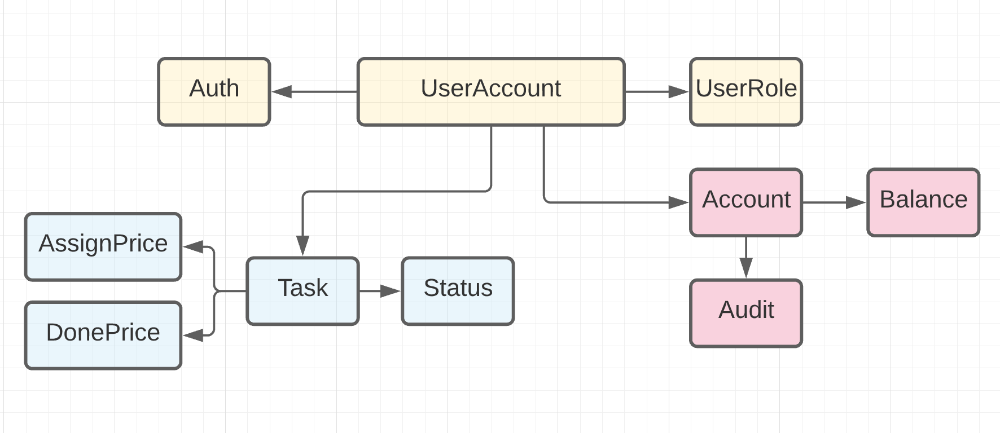

### Команды
#### Создание задачи
```yaml
actor: User
command: CreateTask, GenerateTaskPrice
data: CreatotID, Title, Desc
event: TaskCreatedEvent
```

#### Ассайн задач
```yaml
actor: User
command: AssignTasks
data: 
event: TaskAssignedEvent
```

#### Генерация списания при назначении задачи на попугая
```yaml
actor: TaskAssignedEvent
command: GetAssignCost
data: TaskID, UserID
event: AssignCostCalculatedEvent
```

#### Завершение задачи
```yaml
actor: User
command: CompleteTask
data: TaskID
event: TaskComplitedEvent
```

#### Генерация списания при завершении задачи на попугая
```yaml
actor: TaskComplitedEvent
command: GetDoneCost
data: TaskID, UserID
event: DoneCostCalculatedEvent
```

#### Изменение счета попугая
```yaml
actor: DoneCostCalculatedEvent, AssignCostCalculatedEvent
command: ChangeAccountBalance
data: UserID, Amount
event: ChangeAccountBalanceEvent
```

#### Аудит изменение счета попугая
```yaml
actor: ChangeAccountBalanceEvent
command: AuditChangeAccountBalance
data: UserID, Balance, Amount
event: AuditBalanceEvent
```

#### Подсчет заработанного попугаем за день
```yaml
actor: CRON
command: CalculateDailyBalance
data: UserID
event: BalanceCalculatedEvent
```

#### Отправка информационного письма попугу
```yaml
actor: BalanceCalculatedEvent
command: SendDailyMessage
data: UserID, Balance
event: DailyMessageSendEvent, BalanceCalculatedEvent
```

### Модель данных и домены

> Модель данных


> Список доменов

### Сервисы системы
